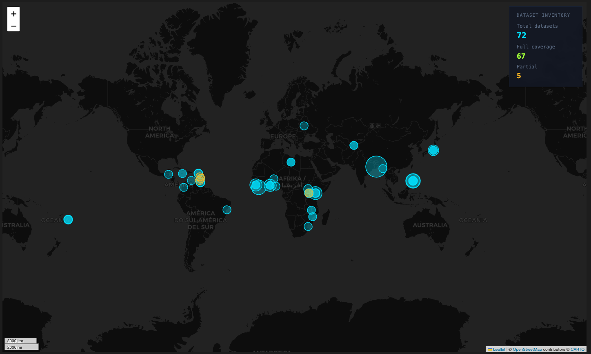

<div align="center">

# Assessment of Satellite-derived Building Datasets 

</div>

## Overview
This repository contains a pipeline for downloading global satellite-derived building footprints datasets filtered down to selected AOIs. It contains pipeline for vector datasets (`Overture`, `Global Building Atlas`, and `3D-GloBFP`) and raster datasets (`Google Open Building Temporal 2.5D`, `TEMPO`, `WSF-Tracker`, and `GHSL Built-up and Height`) for AOIs with high-quality reference datasets. 

The pipeline is config driven and rely on an `aoi_tracker` to identify the folders containing the `aoi` geojson and the `reference` data. 

## Example
### Vector Download Pipeline
```python
from src.vectordownloader import UrbanVectorDownloader

BASE = "/content/drive/MyDrive/Gates Foundation/Building Dataset Validation"
CONFIG = f"{BASE}/configs/data_configs.yaml"
UrbanVectorDownloader(CONFIG).run_connection()
```

### Raster  Download Pipeline
```python
TODO
```

### Data Validation Pipeline 
```python
TODO
```

## Data availability 
Our datasets and validation are provided for these AOIs: 



Dataset would be provided publicly here: 


## License 
This code repository and corresponding datasets are distributed under the MIT License. See `LICENSE` for more information 

## Citation

```
@misc{gfdrr2026,
  title={Urban Validation},
  author={},
  year={2026},
  organization={GFDRR},
  type={Dataset},
  howpublished={\url{https://github.com/GFDRR/urban_validation}}
}
```
