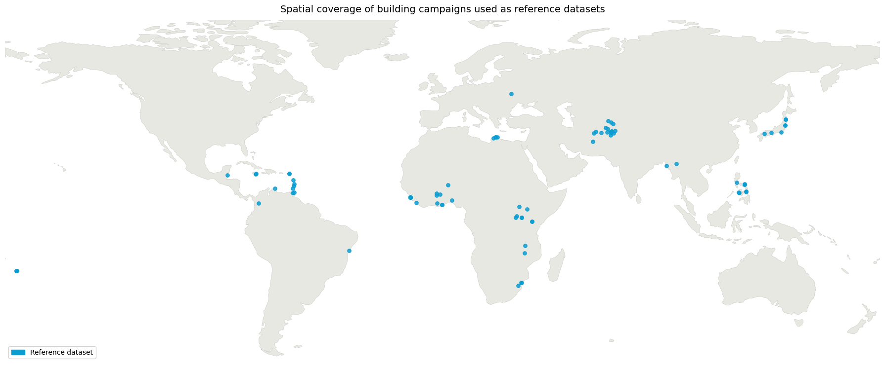

<div align="center">

# Assessment of Satellite-derived Building Datasets 

</div>

## Project overview
This repository contains a config-driven pipeline for downloading and benchmarking global building-footprint and settlement-layer datasets over selected AOIs.

The download pipeline covers vector datasets such as `Overture`, `Global Building Atlas`, and `3D-GloBFP`, and raster datasets such as `Google Open Buildings`, `TEMPO`, `WSF-Tracker`, and `GHSL Built-up and Height`.

The validation pipeline compares each candidate dataset against AOI-specific reference building footprints. It uses an AOI inventory file to find the city folder, AOI geometry, and reference data for each evaluation area.

<div align="center">

## Data availability 
The repository is set up to run over the AOIs listed in `data/02_interim/aoi_tracker.csv`. Each row points to the AOI boundary and reference footprint files for a city.

</div>



Dataset would be provided publicly here: 


## Validation approach
The validation framework has two evaluation paths.

Vector datasets are validated as object-based building footprints. The pipeline clips and repairs geometries where needed, removes very small polygons below the configured minimum area threshold, tiles each AOI into fixed evaluation units, and performs greedy IoU-based one-to-one matching between reference and candidate footprints. It then reports TP, FP, FN, precision, recall, F1, IoU summaries, boundary F-scores, area error, size-bin metrics, and city-level count and density summaries.

Raster datasets are validated as gridded built-up layers. The pipeline reprojects each raster to the AOI CRS, aligns it to one or more evaluation grids, rasterizes the reference footprints into fractional built-up area, thresholds both reference and prediction to built-up masks, and computes area-based precision, recall, F1, relative area error, quantity disagreement, allocation disagreement, and building-count estimates derived from the reference mean building size.

Both paths write tile-level outputs first and then aggregate to city-level summary tables and figures.


## Code organization

| Module | Role |
|--------|------|
| `src/downloader.py` | `UrbanDownloader` — downloads vector and raster datasets for all cities in the AOI inventory |
| `src/validator.py` | `UrbanValidator` — thin orchestrator that dispatches vector and raster validation per city |
| `src/validate/vector_runner.py` | Tile-level vector validation, match consolidation, city summaries, density summaries, and vector figures |
| `src/validate/raster_runner.py` | Tile-level raster validation, city summaries, and raster figures |
| `src/metrics/vector/*` | IoU matching, boundary metrics, size-bin metrics, and vector tile assembly |
| `src/metrics/raster/*` | Raster alignment, reference rasterization, binarization, disagreement metrics, and raster tile assembly |
| `src/plots/output.py` | City-level summaries and the standard vector/raster figures |
| `src/plots/figures.py` | Figure dispatchers for vector and raster validation |
| `src/utils/*` | AOI loading, tiling, building loading, geometry repair, memory helpers, and weighted aggregation |
| `src/config.py` | Typed dataclass config for the download pipeline |

Configuration is split across two files:
- `configs/data_configs.yaml` — controls which datasets to download and from where
- `configs/validation_configs.yaml` — controls validation thresholds, candidate datasets, evaluation grids, and output format


## Usage Example
### Setup requirements

```bash
conda env create -f environment.yaml
conda activate urban_validation
pip install duckdb psutil earthengine-api
earthengine authenticate   # required for Google OBT and GHSL downloads
```

### Data Preparation and Download 
#### Vector datasets download pipeline
```python
from src.downloader import UrbanDownloader

UrbanDownloader("configs/data_configs.yaml").download_vector()
```

#### Raster download pipeline
```python
from src.downloader import UrbanDownloader

UrbanDownloader("configs/data_configs.yaml").download_raster()
```

Raster files are saved as:
- Google OBT: `data/01_raw/<city>/raster/<city_slug>_obt_<year>.tif`
- Microsoft TEMPO: `data/01_raw/<city>/raster/<city_slug>_tempo_<quarter>.tif`
- GHSL: `data/01_raw/<city>/raster/<city_slug>_ghsl_<product>_<year>.tif`

### Data Validation Pipeline 
#### Vector datasets validation
```python
from src.validator import UrbanValidator

v = UrbanValidator("configs/validation_configs.yaml")
v.validate_vector()
```

Outputs per city are written to `outputs/metrics/<city>/` and `outputs/figures/<city>/`. Vector outputs include tile metrics, match records, city-level summary tables, size-bin metrics, and density/count summaries. Candidate datasets and preprocessing thresholds are controlled via `configs/validation_configs.yaml`.

See `notebooks/vector_validator.ipynb` for the Colab-ready notebook.

#### Raster datasets validation
```python
from src.validator import UrbanValidator

v = UrbanValidator("configs/validation_configs.yaml")
v.validate_raster()
```

Each raster dataset entry in `configs/validation_configs.yaml` specifies a `name`, `year`, binarization method, and optionally a native resolution and rasterization settings. The pipeline resolves the exact file for each city from the `year` field — for example, setting `year: 2020` for `ghsl_built_s` loads `<city_slug>_ghsl_built_s_2020.tif`. Multiple years of the same product can be validated by adding separate entries.

See `notebooks/raster_validator.ipynb` for the Colab-ready notebook.

### Result visualization 
The validation pipeline writes city-level summaries and figures for both vector and raster datasets. The standard outputs now include building-count analytics in addition to IoU, area error, and F1 summaries:

- `outputs/metrics/<city>/vector_city_summary_all_datasets.{parquet,csv}` includes reference/candidate count totals and count deltas.
- `outputs/metrics/<city>/vector_city_density_summary.{parquet,csv}` includes per-source counts, densities, and count-vs-reference deltas.
- `outputs/metrics/<city>/raster_city_summary_all_datasets.{parquet,csv}` includes predicted/reference building counts, count deltas, and relative count differences.
- `outputs/figures/<city>/` contains the standard tile/F1/IoU plots plus building-count comparison figures.

See `examples/quick_run.md` for a minimal end-to-end run recipe.

### File Organization
The datasets are organized as follows:

```text
data/
  01_raw/<city>/
    aoi/           AOI boundary files
    vector/        candidate building parquets
    raster/        raster settlement layers
  02_interim/
    aoi_tracker.csv

outputs/
  metrics/<city>/
    vector_metrics_tiles_<dataset>.parquet
    vector_matches_all_datasets.parquet
    vector_city_summary_all_datasets.{parquet,csv}
    vector_city_density_summary.{parquet,csv}
    raster_metrics_tiles_<dataset>.parquet
    raster_city_summary_all_datasets.{parquet,csv}
  figures/<city>/
    *_f1_*.png
    *_iou_*.png
    *_building_counts_*.png
```

The exact filenames depend on the enabled datasets and evaluation grids in `configs/validation_configs.yaml`.


## License 
This code repository and corresponding datasets are distributed under the MIT License. See `LICENSE` for more information 

## Citation

```
@misc{gfdrr2026,
  title={An assessment of satellite derived global urban datasets for operational and analytical use cases},
  author={},
  year={2026},
  organization={GFDRR, The World Bank Group},
  type={Dataset},
  howpublished={\url{https://github.com/GFDRR/urban_validation}}
}
```

## Contributors
Rufai Omowunmi Balogun,
Caroline Margaux Gevaert, 
Derrick Mirindi, 
Aaron Opdyke,
Capucine Anne Veronique Riom, 
Pierre Chrzanowski1, and Edward Charles Anderson1

## Acknowledgment
GFDRR, World Bank,

Gates Foundation,

HOTOSM Datasets, 

World Bank Datasets, 

Partner Countries for on ground validation datasets,
 
Feedback from other Team in the World Bank Digital Earth Partnership 